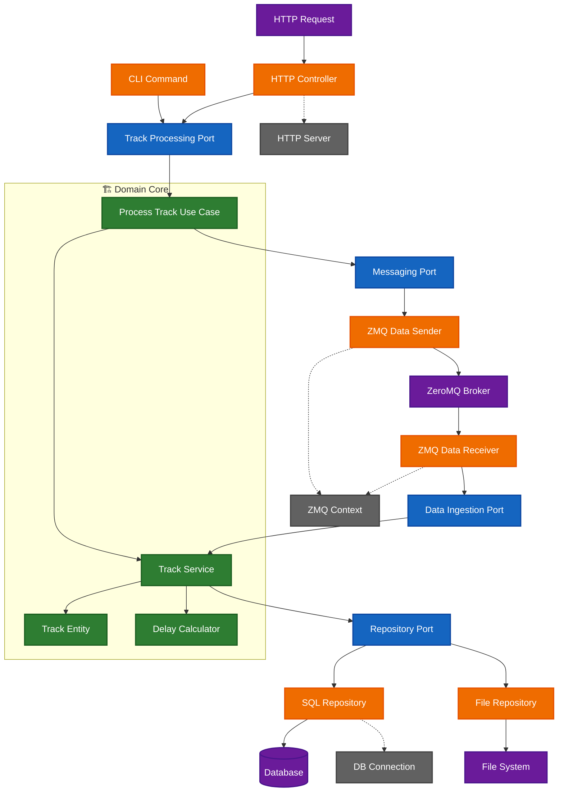
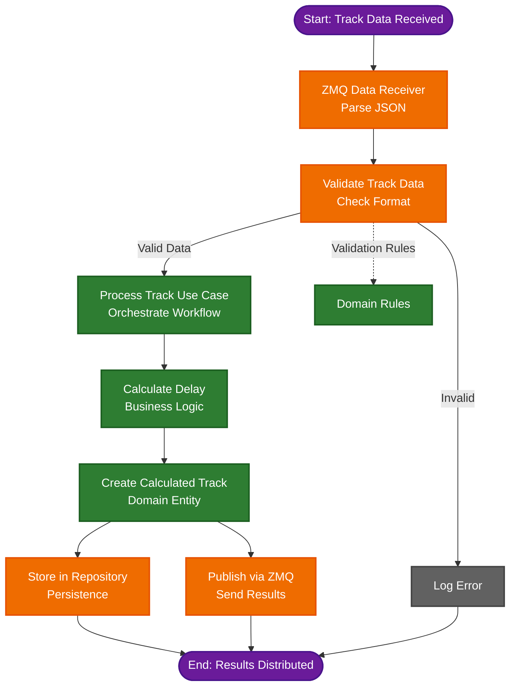
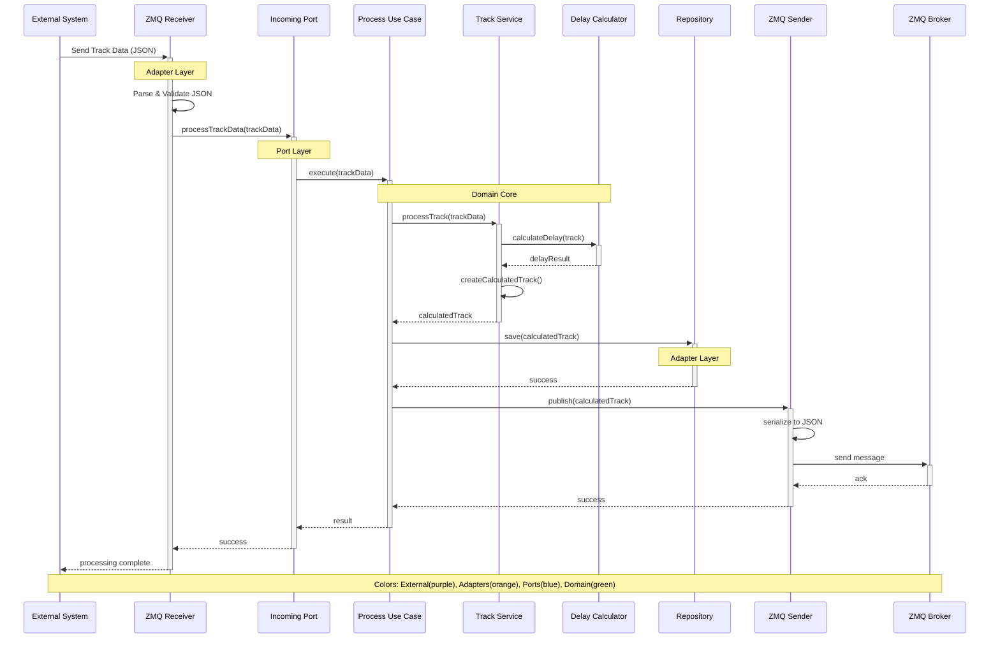

# Hexagonal Architecture Documentation

## Overview

This project demonstrates a **Hexagonal Architecture** (also known as Ports and Adapters) implementation in C++17. The architecture emphasizes separation of concerns, testability, and maintainability by isolating the core business logic from external concerns.

## Architecture Layers

The system is organized into distinct layers with clear boundaries:

### Color Legend
- **Domain/Core**: #2e7d32 (green) - Business logic, entities, value objects
- **Ports**: #1565c0 (blue) - Interfaces defining contracts
- **Adapters**: #ef6c00 (orange) - Implementation of external integrations  
- **Infrastructure**: #616161 (gray) - Framework and technical concerns
- **External Systems**: #6a1b9a (purple) - Third-party services and databases

## High-Level Component Diagram

Hexagonal Architecture Overview

    

Domain/Core

    

Ports

    

Adapters

    

Infrastructure

    

External Systems

## End-to-End Data Flow

Track Processing Flow

## Sequence Diagram: Track Processing Use Case

Track Processing Sequence

## Component Responsibilities

### Domain Core (Green)
- **Entities**: `TrackData`, `DelayCalculatedTrackData` - Core business objects
- **Value Objects**: Immutable data structures with business meaning
- **Domain Services**: `CalculatorService` - Business logic implementation
- **Use Cases**: High-level business workflows and orchestration

### Ports (Blue)
- **Incoming Ports**: Interfaces for external actors to interact with the system
- **Outgoing Ports**: Interfaces for the system to interact with external resources
- Define contracts without implementation details

### Adapters (Orange)
- **Incoming Adapters**: `ZeroMQDataReceiver` - Convert external requests to domain calls
- **Outgoing Adapters**: `ZeroMQDataSender` - Convert domain calls to external actions
- Handle serialization, protocol specifics, and external API integration

### Infrastructure (Gray)
- **Frameworks**: ZeroMQ context management, HTTP servers
- **Cross-cutting Concerns**: Logging, monitoring, configuration
- **Technical Implementation**: Connection pooling, threading

### External Systems (Purple)
- **Message Brokers**: ZeroMQ broker infrastructure
- **Databases**: Persistent storage systems
- **APIs**: Third-party service integrations
- **File Systems**: Local or distributed storage

## Benefits of This Architecture

1. **Testability**: Core logic can be tested without external dependencies
2. **Flexibility**: Easy to swap implementations (e.g., ZMQ → HTTP, SQL → NoSQL)
3. **Maintainability**: Clear separation of concerns reduces coupling
4. **Scalability**: Each layer can be optimized independently
5. **SOLID Principles**: Architecture naturally enforces good design principles

## Testing Strategy

- **Unit Tests**: Test domain logic in isolation
- **Integration Tests**: Test adapter implementations
- **Contract Tests**: Verify port interfaces
- **End-to-End Tests**: Full system workflow validation
